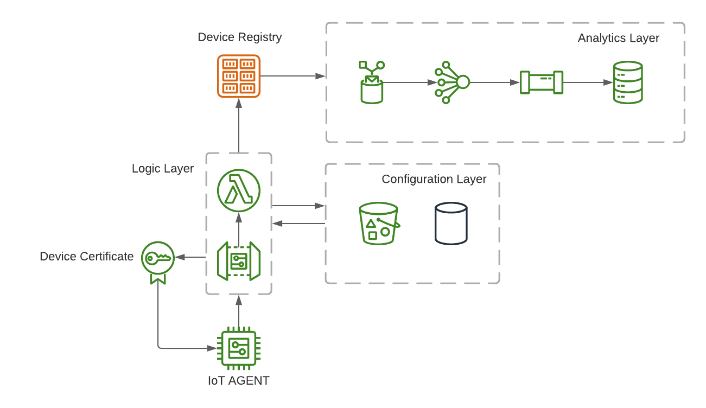

# aws-iot-certificate-vending-machine - AWS IoT Device Registration Gateway

- Designed to provide a common registration entrypoint for AWS IoT devices.
- Avoids complexity of current AWS IoT fleet provisioning workflows.
    - Not integrated into Cloudformation or other cloud deployment frameworks.
    - Certificates required to be provisioned into devices.
    - Requires advanced AWS IoT knowledge.
- Easy to deploy / maintain / keep source control with AWS CDK and Cloudformation.
- Code architecture designed to be easily extendable to cover custom cases.
- Designed for Serverless Architecture, portable to other types of architectures.

**Architecture**
---

**Installation**
---

1. Install AWS CDK (Getting started guide can be followed [`here`](https://docs.aws.amazon.com/cdk/latest/guide/getting_started.html))
    + `$ npm install -g aws-cdk`
    
2. Install Python dependencies (make sure to use Python3.7 or newer)
    + `pip install -r etc/pip/requirements.txt`
    
3. Make sure that you have Docker installed and running, will be required to build Python's dependencies

**Usage**
---

1. Add modification to `cdk.json` in order to add customizations to your project.

2. Execute `cdk diff` and `cdk deploy` to deploy your project.

3. Default environment created is `dev` but other environments can be created by adding keys to `cdk.json` at the same level that `dev` is.

**Structure**
---

- API Gateway that points to a Lambda function.
- Lambda Function that will be in charge of authorize and register devices plus will return the certificate information to the registering devices.
    - Lambda Layer with external dependencies.
- SSM Parameter Store that will contain the application configuration.
- AWS IoT Analytics data storage for AWS IoT Registry events (broker subscription has to be enabled in AWS IoT).

    
**How to Contribute**
---

1. Clone repo and create a new branch: `$ git checkout https://github.com/u93/aws-iot-certificate-vending-machine -b ${BRANCH_NAME}`.
2. Make changes and test
3. Submit Pull Request with comprehensive description of changes